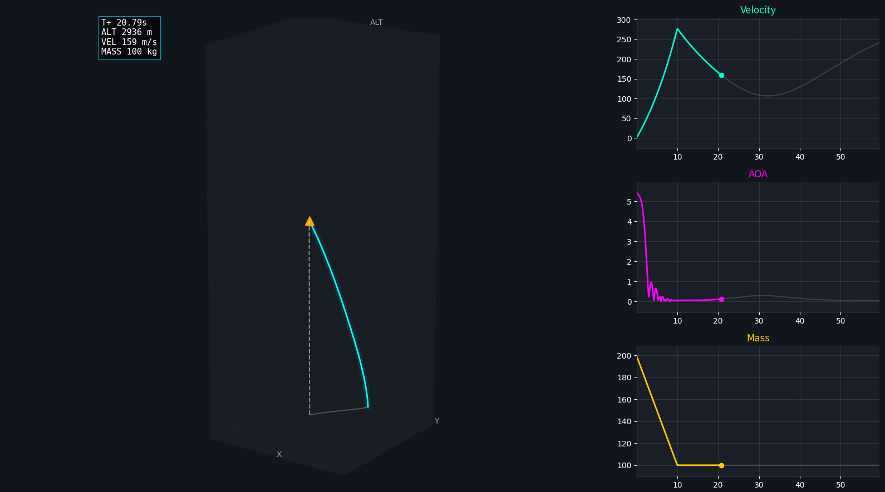

# Flight Dynamics Engine

A C++20 engine for modeling rigid-body 6-DOF (Degrees of Freedom) flight dynamics. Developed as a modular framework for atmospheric flight simulation, this engine focuses on the physics of aerodynamics, propulsion, and environment. 

The architecture runs as a **headless native Windows C++ server** that streams real-time telemetry (60fps) via WebSockets to a decoupled React/Three.js web frontend for 3D visualization.



### Technical Implementation
* **Kinematics:** Quaternion orientation to avoid gimbal lock.
* **Atmosphere:** Simple model for pressure and density scaling based on altitude.
* **Aerodynamics:** Lift and Drag coefficient calculations.
* **Propulsion:** Variable mass modeling to account for fuel depletion during motor burn.
* **Integration:** Euler method for state updates.
* **Networking:** WIP.

### Project Structure
* Restructuring

## Dependencies & Setup (Windows Native)

This project has been migrated away from WSL2 and now compiles natively on Windows using **MSYS2 / MinGW-w64**.

To install the required compiler and networking libraries, open your MSYS2 terminal and run:
```bash
pacman -S mingw-w64-x86_64-toolchain mingw-w64-x86_64-make mingw-w64-x86_64-nlohmann-json mingw-w64-x86_64-asio mingw-w64-x86_64-websocketpp
```

## Build & Run

You can build and launch the server from any standard Windows terminal (PowerShell, Command Prompt, or VS Code integrated terminal).

**1. Compile the Headless Engine**
```cmd
mingw32-make
```

**2. Launch the Simulation Server**
```cmd
mingw32-make run
```
*(The server will run quietly in the background on port 9000, waiting for the UI to connect).*

**3. Launch the Visualization UI**
In a separate terminal, start the React frontend:
```cmd
cd frontend
npm run dev
```
Open `http://localhost:5173` in your browser. The UI will automatically connect to the C++ WebSocket server and begin rendering the 3D flight path.
